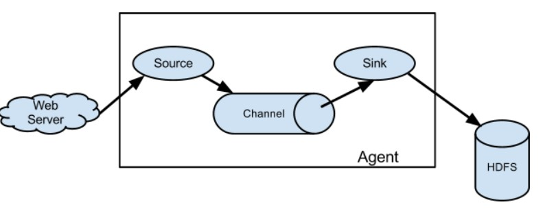
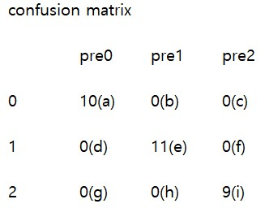
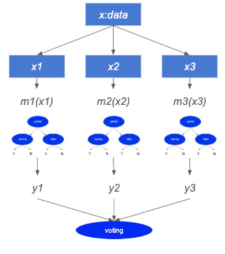
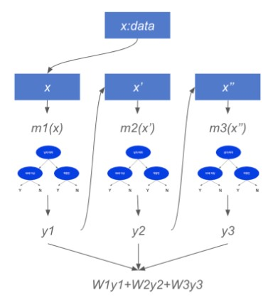

# 의사결정 트리(Decision Tree)
 - MachineLearning에서 지도 학습의 알고리즘으로 분류, 회귀 분석목적으로 사용한다.
 - 트리 구조 표현을 통해 분류와 예측을 수행하는 분석 방법이다.
 - 분류 or 예측 과정이 트리구조로 표현되어 비교적 쉽게 이해가능하다.
 - 종류
   - 범주형 목표변수(Classification Tree)
     - 예측하고 싶은 값이 정수
     - 목표변수가 이산형인 경우, 각각의 범주에 속하는 빈도에 기초해 분리한다.
     - 주로 값을 분류할 때 사용
     - 사용사례
       1. 유방암 분류
       2. 붓꽃 분류
   - 연속형 목표변수(Regression Tree)
     - 목표변수가 연속형인 경우, 평균과 표준편차에 기초해 분리한다.
     - 예측하고 싶은 값(종속값)이 실수
     - 주로 회귀할 때 사용
       > 값을 예측할 때
     - 사용사례
       1. 집값 예측
       2. 주식가격 예측
 - 종속변수, 독립변수 : 정수, 실수
   

## 분리기준(Split Criterion)
   - 부모 노드로부터 자식 노드들이 형성될 때, 생성된 자식 노드에 속하는 자료의 순수도가 가장 크게 증가하도록 트리를 형성하며 진행한다.
   - 입력변수를 이용해 목표 변수의 분포를 얼마나 잘 구별하는 정도를 파악하고, 노드가 형성되는데 목표 변수의 구별 정도를 불순도에 의해 측정한다.
   - 지니 지수가 가장 낮은걸 찾아서 분리한다.
  

### 지니 지수(Gini Index)
 - 데이터 집합의 불순도를 측정
 - 지니 지수는 0 ~ 1 사이의 값을 가지며, 어떤 데이터 집합에 속한 개체들이 같은 범주로 구성되어 있으면 지니 지수는 최솟값이 0을 가지고 해당 데이터 집합은 순수하다고 볼 수 있다.
 - 지니 지수가 작을수록 잘 분류된 것으로 볼 수 있다.
 - 계산식
   - $G=1-\sum_{j=1}^{c}P(j)^2=1-\sum_{j=1}^{c}(\frac{n_{j}}{n})^2$
	> C : 범주의 수  
	> p(j) : j번째 범주에 분류될 확률  
	> n : 노드에 속하는 개체 수  
	> $n_{j}$ : 노드에 속하는 수 중 j번째 범주에 속하는 개체수   
 - 계산 예시  
	

 

# Spark
 - 빅데이터, 전처리, Machine Learning을 쉽게 할 수 있도록 돕는 framework
 - 빅데이터를 블록으로 나눠서 멀티 프로세스로 분석하기 때문에 빠르게 처리가 가능하다.
 - 리눅스 환경에서 Hadoop, Hive, 연동해서 사용한다.
 - 구조 및 구성요소  
 
   > SQL : 정형화된 SQL지원한다.  
   > Streaming : 데이터 스트림을 세그먼트로 나눈 후 각각을 스파크 엔진으로 처리한다.  
   > MLlib : 회귀, SVM, 의사결정트리, 랜덤포레스트 등 ML 라이브러리를 제공한다.  
   > GraphX : 페이지 랭크, 레이블 전파, 삼각 계수 등 그래프 알고리즘을 지원한다.  
   > Core : 분산 처리, 스케줄링, API 인터페이스를 지원한다.  
   > 작업 처리 레이어 : 스파크만으로 처리할 수도 있고, Hadoop Yarn, Mesos 등과 연동이 가능하다.  

 

## RDD(Resilient Distribute Dataset)
 - 스파크의 기본 추상화 객체
 - 특징
   - 불변성(immutable) : 읽기전용
   - 복원성(resilient) : 장애 내성
   - 분산성(distributed) : 노드 한 개 이상에 저장된 데이터 셋  
 

## 스파크 클러스터링
 - 대부분 Hadoop Yarn을 사용하지만 다양한 클러스터 시스템과 연동가능하다.
 - 연동가능한 클러스터 시스템
   - Apache Hadoop Yarn
   - Kubernetes
   - Apache Mesos
   - Spark Standalone

 

# 랜덤포레스트(Random Forest)
 - 여러개의 Decision tree를 결합하여 단일 Decision tree의 단점을 극복했다.
 - Over-fitting 문제가 적게 발생한다.
 - 구현이 쉽다.
 - 병렬 계산이 편하다.
 - 원본에서 행과 열을 random하게 선택한다.
   - 원본 데이터의 수 만큼 선택
   - 같은 행의 데이터는 중복을 허용
     > Gini index가 다르면 다른 Decision tree로 본다.  
   - 같은 행의 데이터와 샘플 데이터는 중복을 허용
   - 선택한 샘플 데이터를 바탕으로 Decision tree 생성
   - 예시  
   

 

## 칼럼의 중요도(Gain)
 - 원본 데이터의 정확도 계산
 - 하나의 칼럼을 제외한 나머지 칼럼으로 정확도 계산
 - 원본 데이터의 정확도 - 나머지 칼럼의 정확도
   > 해당 값이 클수록 중요하다.   

 

# Confusion matrix
 - 계산법
   - $precision = \frac{a}{a + b + c}$
   - $recall = \frac{a}{a + b + c}$
   - $f1_score = 2*\frac{precision*recall}{precision+recall}$
   - $MacroAvg = \frac{prec0+prec1+prec2}{prec의 개수}$  
   - $WeightAvg = \frac{prec*a+prec*e+pred*i}{전체개수}$
 - 예시  
  

 

# XGBoost
 - 회귀와 분류 문제를 모두 지원하며, 성능과 자원 효율이 좋은 알고리즘이다.
 - 여러개의 Decision Tree를 조합해서 사용하는 Ensemble 알고리즘이다.
   > 여러개의 모델을 조합해서 결과를 뽑아내는 방법이다.  
   > Ensemble은 방식에 따라 Bagging과 Boosting으로 분류된다.  
 - Bagging은 여러 모델을 사용할 때, 각 모델에서 나온 값을 계산하여, 최종 결과값을 내는 방식이다.  
  
 - Boosting은 샘플링된 데이터에서 값들의 가중치를 반영하여 다음 모델에 넣는 방식으로 예측값을 구한다.  
  
 - Boosting 알고리즘을 구현한 객체

<!-- 결측치
 - 계산불가
 - DecisionTree 생성 불가
   - 평균값 or 0으로 결측치를 바꿈 -->

<!-- 불균형 데이터 (Imbalance Data)
 - 정상제품의 특징 파악 및 정상 제품 학습 -> 학습한 데이터 아님(불량)
 - Surport Vector Machine : ML에서 사용
 - Anogan : DL에서 사용 

다중공선성 분석 -> 부차적인것을 제거하는 방법
 - 독립변수끼리 연관관계 높은 칼럼 삭제
 
 - 업무량만 나두고 스트레스, 수면시간을 제거
   > 통계학적 관점   -->

 

# 상관관계 분석
 - 두 변수간에 어떤 선형적 관계를 갖고 있는지를 분석하는 방법이다.
 - 두 변수간의 관계의 강도를 상관관계라고한다.
 - 두 개의 변수에 대해 관계가 있는 가를 측정하는 단순상관분석, 3개 이상의 변수들 간의 관계를 측정하는 다중상관분석이라 한다.
 - 연속형수치로 이뤄진 변수와 변수 사이의 관계를 말한다.
 - 양의 상관관계와 음의 상관관계 그리구 무 상관관계 등으로 구분한다.
 - 상관관계의 종류
   - 양의 상관관계
     - 양의 상관관계는 변수 1이 증가함에 따라 변수 2도 같이 증가하는 것을 의미한다.
     - b보다 a가 기울기가 양인 직선에 가깝게 자료가 모여있는데 이를 a는 b보다 큰 양의 상관관계를 나타낸다.
     - c의 경우 데이터가 좌표상에 완전히 흩어져 있는 것처럼 보이기 때문에 각 변수간의 상관관계가 없다.  
      
   - 음의 상관관계
     - 음의 상관관계는 변수 1의 수치에 따라 변수 2의 수치가 반대로 감소하는 관계를 의미한다.
     - e보다 d가 보다 큰 음의 상관관계를 나타낸다.
     - f의 경우 데이터가 좌표상에 완전히 흩어져 있는 것처럼 보이기 때문에 각 변수간의 상관관계가 없다.  
      
   - 무 상관관계  

 

## 공분산
 - 2개의 확률변수의 상관 정도를 나타내는 값이다.  
  
 - X, Y는 독립사건
   - X, Y가 서로 관계없는 독립사건이라고 생각하면 c 같은 형태를 보인다.
   - $Cov(X, Y) = 0$
     > 공분산이 0인 확률 변수를 비상관 확률변수라 한다.  
     > 하지만 주의할 점은 역은 성립하지 않는다.  
     > 즉 X, Y가 독립이 아니더라고 공분산의 값은 0이 될 수 있다.   
 - X가 증가할 때, Y도 증가한다.
   - 위 그림에서 a 같은 형태를 보인다.
   - $Cov(X, Y) > 0$
 - X가 증가할 때, Y는 감소한다.
   - 위 그림에서 b 같은 형태를 보인다.
   - $Cov(X, Y) < 0$  

 

### 공분산 공식
  - 실수 값을 지니는 2개의 확률변수 X와 Y에 대해서 공분산의 기댓값을 다음과 같이 정의 할 때,
  - 계산식
    - $E(X) = \mu$, $E(Y) = v$
    - $Cov(X, Y) = E((X - \mu)(Y - v))$
    - $Cov(X, Y) = E(X * Y) - \mu v$
    - $E(X * Y) = E(X) * E(Y) = \mu v$

 

### 공분산의 성질
 - X, Y가 실수값인 확률변수이고 a, b가 상수라면, 공분산에 대해서 아래와 같은 법칙이 성립한다.
   1. $Cov(X, X) = Var(X)$
   2. $Cov(X, Y) = Cov(Y, X)$
   3. $Cov(aX, bY) = ab$ $Cov(X,Y)$
 - 공분산은 확률변수들의 벡터 공간상에서의 내적을 의미한다.

 

### 공분산의 행렬
 - 항상 컴퓨터 계산을 통해 연산하려면 행렬로써 나타내는 게 용이하기 때문에 중요하며, 열 벡터 값을 가지는 확률변수 X, Y에 각각의 기댓값을 뺴주어 아래의 식처럼 계산하면 공분산을 구할 수 있다.
 - 계산식
   - $Cov(X, Y) = E((X - \mu)(Y - v)^T)$

 

### 공분산의 문제점
 - 공분산은 단순한 상관관계의 방향만을 알려준다.
 - 상관관계의 정도는 알 수 없다.
   - 확률변수의 단위 크기에 영향을 많이 받기 때문이다.
   > 각 확률변수의 단위크기가 크면 무조건 공분산의 크기가 크게 나오는 문제가 발생한다.  
 - 이를 해결하기 위해 상관계수를 사용한다.

 

### 상관계수
 - 확률변수의 절대적 크기에 영향을 받지 않도록 공분산을 단위화 시킨 것이다.
 - 공분산에 각 확률변수의 분산을 나눠줬다고 생각하면 된다.
 - 계산식
   - $\rho=\frac{Cov(X, Y)}{\sqrt{Var(X)*Var(Y)}},$ $-1<=\rho<=1$

 

#### 상관계수의 성질
 - 상관계수의 절댓값은 1을 넘지 않는다.
 - 확률변수 X, Y가 독립이라면 상관계수는 0이다.
 - 상관관계
   - $0<\rho<=+1$이면 양의 상관
   - $-1<=\rho<0$이면 음의 상관
   - $\rho=0$이면 무상관